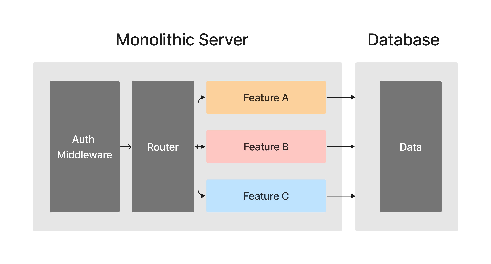
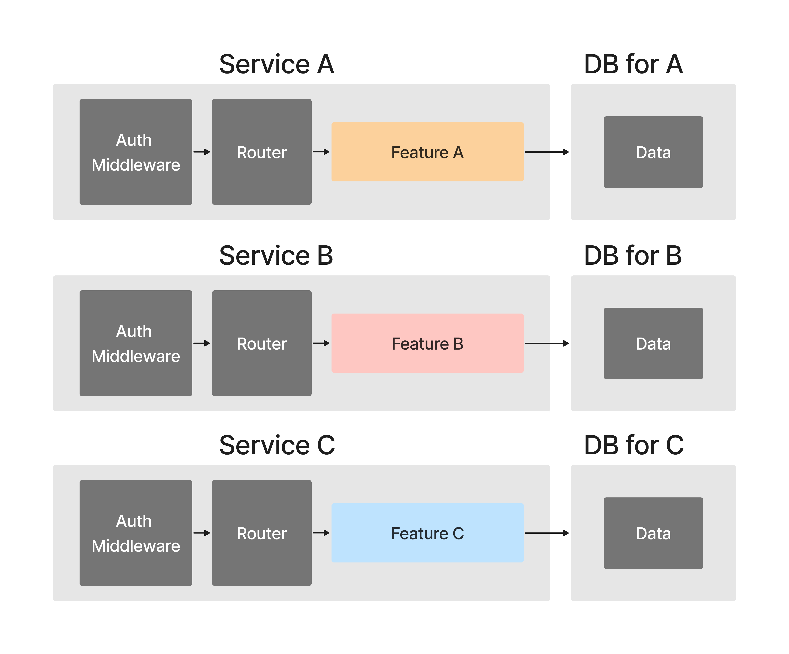
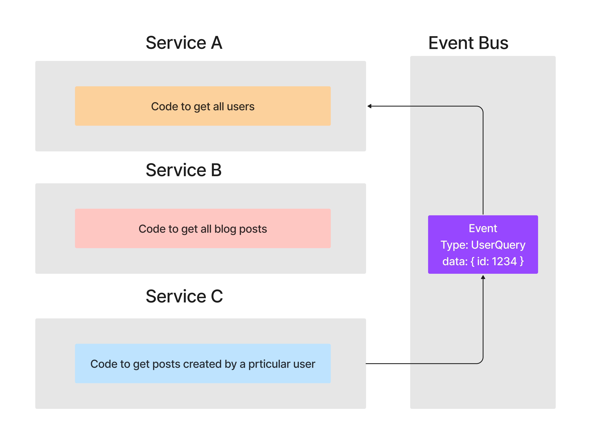
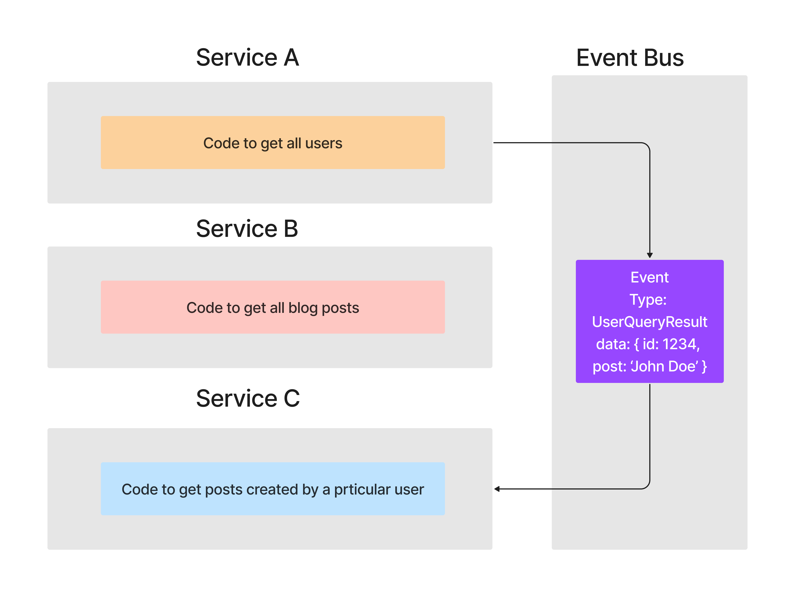

# Kotlin overview research (Micronaut) - part 1

## Kotlin Documentation

[Kotlin documentation](https://kotlinlang.org/docs/home.html) is an artifact that describes the programming language in usage. Any user, developer, or architect can read it and implement it in their projects. It also refers to other libraries that can be combined, such as GraphQL, RabbitMQ, ReactJS, etc. It provides a solid explanation of the primary usage of the language. In addition, Kotlin documentation provides a short educational walk through for users without prior knowledge.

### Target Audience

Kotlin documentation is for anyone who wants to learn the Kotlin language or brush up on it. Developers use multiple languages, and it's unlikely to remember all the syntax. Documentation is an excellent reference tool to have open while a developer is writing code.

## Research Overview - Micronaut

For most of my time at NIC, I have been focused on the visual aspects of apps and the Front-end. I want to approach this research from the Back-end perspective and learn more about [microservices architecture](https://microservices.io/). Micronaut allows us to build microservices and serverless applications. We will break it down as it comes with a lot of built in features.

### What is microservices architecture?

Before we jump in [Micronaut](https://micronaut.io/), we should refresh our memory on what microservices are and the difference between microservices and monoliths.

### Monolith

To understand microservices, we should look at what a monolith is. For example, if we look at ExpressJS server-side app, we would take the whole app, deploy to a NodeJs server, and build it. The entire app would be on one particular server. All the requests would be directed to the same API address. All the features would have access to the same database.

_See in the image_

<i>Monolithic architecture</i>

| :white_check_mark: Advantage           | :x: Disadvantage                                                                         |
| -------------------------------------- | ---------------------------------------------------------------------------------------- |
| Easy to develop (one app in one place) | A simple change can break the app if the developer doesn't understand the app as a whole |
| Easy to manage (uses one language)     | It is language and framework dependent (must be written in one language).                |
| Easy to deploy                         | As the app grows, the deployment gets worse                                              |
|                                        | If our app becomes popular, one server won't able to handle all the traffic              |

### Microservices

We split the app into smaller independent services. A single microservice contains all the routing, middlewares, business logic, and database access required to implement **one feature** of our app. That is the biggest difference. One app is created by multiple services that interact with each other. However, all the services must be [loosely coupled](https://chrisrichardson.net/post/microservices/2020/12/14/designing-loosely-coupled-services.html).

<i>Microservices architecture</i>

| :white_check_mark: Advantage                                   | :x: Disadvantage                                                                                                |
| -------------------------------------------------------------- | --------------------------------------------------------------------------------------------------------------- |
| All services are self contained                                | Data management between services is extremely difficult                                                         |
| If one service crashes the rest of our app will work just fine | It is difficult to design                                                                                       |
| Can be written in multiple languages and frameworks            | Designing repository structure of our code might be time consuming ex. Monorepo, Polyrepo                       |
| Easy to scale if traffic is higher                             | Designing communicating between services is challenging (API Calls, Message Broker, Service Mesh)               |
| Independently deployable                                       | [Database-per-Service](https://microservices.io/patterns/data/database-per-service.html) causes data redundancy |

### Messaging system

If you are wondering how the services communicate with each other, here is a simple diagram that illustrates that. It is a very simplified version of it. The communication works asynchronously between them due to the Event Bus. The Event Bus delegates events (API calls) between the services. In the case that one crashes, the other dependent service won't also crash.

<i>Messaging system architecture (request)</i>

<i>Messaging system architecture (response)</i>

## Back to Micronaut

After we recapped what microservices architecture is, we can dive into our concrete Kotlin option. _"Micronaut was released in 2018. It is an open source, JVM-based framework for building full-stack, modular and easy testable microservice and serverless applications"._ \[5\] Even though Micronaut is an open-source project, it is fully supported by [OCI](https://www.oracle.com/ca-en/cloud/).

After recapping microservices architecture, we can dive into our concrete Kotlin option. Wait, Java already has [Spring](https://spring.io/) and [Spring Boot](https://spring.io/projects/spring-boot) for building either monolith applications or microservices. However, Spring focuses its energy on both, leaving the microservices part a bit behind and giving space for Micronaut.

Micronaut was partially developed by developers who worked on Spring Boot, so it isn't surprising that it has many built-in features that improve existing frameworks. Micronaut supports many technologies such as Elasticsearch, GraphQL, RabbitMQ, Kafka, Redis, SQL databases, MongoDB etc. Lastly, Micronaut is multilingual and can be used in three languages Java, Kotlin, and Groovy.

## Resources

1. [Microservices explained - the What, Why and How?](https://www.youtube.com/watch?v=rv4LlmLmVWk) \[YouTube\]
2. [What is Microservices Architecture?](https://cloud.google.com/learn/what-is-microservices-architecture) \[Website\]
3. [What are Microservices?](https://www.youtube.com/watch?v=CdBtNQZH8a4) \[YouTube\]
4. [Microservices with Node JS and React](https://www.udemy.com/course/microservices-with-node-js-and-react) \[Udemy\]
5. [Micronaut for Microservices](https://medium.com/software-tidbits/micronaut-for-microservices-7322cc00fb6f) \[Medium\]
6. [INTRODUCTION TO THE MICRONAUT FRAMEWORK: BUILDING ULTRA-LIGHTWEIGHT MICROSERVICES](https://micronaut.io/2018/11/08/introduction-to-micronaut-building-ultra-lightweight-microservices/) \[Website\]
7. [Kotlin & Micronaut - Building a personal finance app](https://www.youtube.com/playlist?list=PLbsmalhjD-3YJ_9fl0uhCIl4EDy9t7adL) \[YouTube\]
8. [IT Operations](https://www.ibm.com/cloud/learn/it-operations) \[Website\]
9. [DevOps](https://www.ibm.com/cloud/learn/devops-a-complete-guide) \[Website\]

## GitHub repository using Micronaut and Kotlin

### [market-api](https://github.com/zsiegel/market-api)

### [Zac Siegel](https://www.zsiegel.com/)

### https://github.com/zsiegel/market-api

Zac has created an excellent walk-through of how to build a microservices project about personal finances with Micronaut and Kotlin. He used Micronaut's integrated libraries for GraphQL, Postgres, JUnit, and more. In the video, he is getting familiar with and exploring Micronaut, which is very nice if you are a novice to Micronaut too. You can explore the technology with him.

## Reflection

Microservices architecture is challenging to design regardless of the language in which it is written. The most significant difficulty with this research is picking up why an app should be developed this way. Once this question is understood, the most challenging is knowing what technologies must be included. It also requires a decent knowledge of [Ops](https://www.ibm.com/cloud/learn/it-operations) from the [DevOps](https://www.ibm.com/cloud/learn/devops-a-complete-guide) circle. I consider myself a Front-End developer, so every aspect of this project is testing my knowledge. Notably, the diagrams I have created based on resources I have watched helped me grasp this topic better.

It has been my secret wish to learn microservices since I have run across them at my internship. I like that I could touch on this topic with Kotlin. Micronaut is a relatively new technology that hasn't been documented much. However, all the resources I have found so far were pretty solid. Also, its documentation is well done. I would love to explore it more.

*\*Disclaimer: All illustrations were made in Figma by me\**
